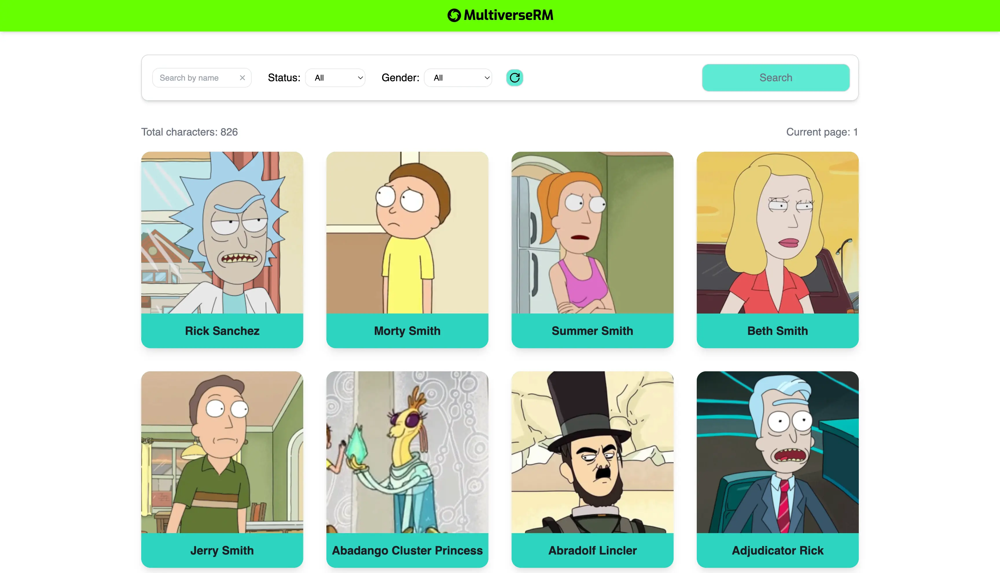
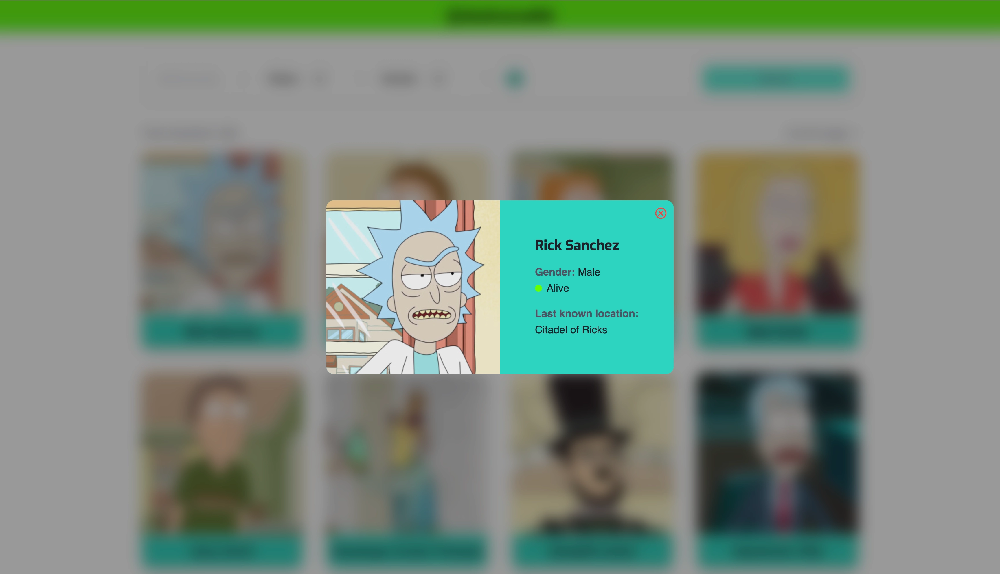

# MultiverseRM - application for events registration

Rick and Morty Multiverse Characters

## Introduction

Welcome! This site features characters from the Rick and Morty multiverse. Users can find their
favorite characters and learn more detailed information about them.

## Features

- **Character Cards**: The page displays 20 character cards, along with information about the total
  number of characters and the current page.
- **Interactive Cards**: When hovering over a card, its color and scale change. Clicking on a card
  opens a modal window with detailed information about the character.
- **Modal Window**: The modal window is rendered through a portal, and scrolling on the page is
  blocked when the modal is open. The modal can be closed by clicking on the backdrop, the close
  icon, or pressing the Esc key.
- **Pagination**: Pagination is located at the bottom of the page. When switching pages, smooth
  scrolling is triggered, which scrolls the page to the top.
- **Filters**: A filter block is located under the header. You can search for characters by name,
  select status, or gender. After selecting the parameters, you need to click the search button to
  display the character cards according to the selected filters.
- **Reset Filters**: A button is provided to reset the filters to their default values, and the
  search field can be cleared separately.
- **Search Results** Message: If no results are found for the given parameters, a corresponding
  message is displayed. **Events-board page**:

## Screenshots

## Technologies Used:

## Demo

This project is deployed on Vercel. Check it out:
[**MultiverseRM**](https://multiverse-rm.vercel.app/)
